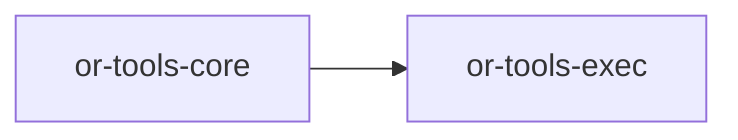

# or-tools-exec

**Status**: Implemented | **Version**: `0.1.2` | **Default features**: `python`, `shell` | **Feature flags**: `python`, `shell`, `e2b`, `bearly`, `daytona`, `all`

Code execution tools for Orchustr. The crate defines a normalized execution request/result model, routes requests to the first executor that supports the requested language, and provides both local-process executors and feature-gated remote sandbox integrations.

## In Plain Language

This crate is the execution layer. When Orchustr needs to run Python, a shell command, or code in a remote sandbox, this crate decides which executor can handle the request and then returns the result in one normalized format.

For less technical readers, the key idea is that `or-tools-exec` is about "run this code and tell me what happened." It is not a workflow engine, a package manager, or a long-term job runner. For contributors, it is the integration point for local executors and remote sandbox providers.

## Responsibilities

- Define the common execution request, result, language, and error types.
- Provide the `CodeExecutor` contract implemented by each backend.
- Route each request to the first executor that declares support for the requested language.
- Normalize stdout, stderr, exit code, and duration into one shared result shape.
- Stop at execution itself; higher-level orchestration, persistence, and workflow state live elsewhere.

## Position in the Workspace

## Implementation Status

| Component | Status | Notes |
|---|---|---|
| Domain contracts | Implemented | `CodeExecutor`, `Language`, `ExecRequest`, `ExecResult`, and `ExecError` are present and re-exported. |
| Orchestration | Implemented | `ExecOrchestrator` selects the first executor whose `supports()` matches the requested language. |
| Tool adapter | Implemented | `ExecTool` exposes execution through `Tool`. |
| Local executors | Implemented | `PythonExecutor` and `ShellExecutor` ship in the default feature set. |
| Remote executors | Implemented | `E2BExecutor`, `BearlyExecutor`, and `DaytonaExecutor` are feature-gated in `src/infra/`. |
| Unit tests | Implemented | `tests/unit_suite.rs` covers routing, invalid payloads, success helpers, and the shell executor path. |

## Public Surface

- `CodeExecutor` (trait): async contract implemented by each runtime backend.
- `Language` (enum): normalized language selector.
- `ExecRequest` (struct): execution request with code, language, timeout, and env map.
- `ExecResult` (struct): normalized execution result with stdout, stderr, exit code, and duration.
- `ExecError` (enum): execution-specific error model.
- `ExecOrchestrator` (struct): routing layer across registered executors.

## Feature Flags and Backends

| Feature | Module | Main type | Supports | Config from env |
|---|---|---|---|---|
| `python` | `infra/python.rs` | `PythonExecutor` | `Language::Python` | none |
| `shell` | `infra/shell.rs` | `ShellExecutor` | `Language::Shell` | none |
| `e2b` | `infra/e2b.rs` | `E2BExecutor` | any `Language` value | `E2B_API_KEY` |
| `bearly` | `infra/bearly.rs` | `BearlyExecutor` | `Language::Python` | `BEARLY_API_KEY` |
| `daytona` | `infra/daytona.rs` | `DaytonaExecutor` | any `Language` value | `DAYTONA_SERVER_URL`, `DAYTONA_API_KEY` |

## Dependencies

- Internal crates: `or-tools-core`
- External crates: async-trait, reqwest, serde, serde_json, thiserror, tokio, tracing

## Known Gaps & Limitations

- `PythonExecutor` invokes `python3` directly, so availability depends on the host PATH.
- `ShellExecutor` chooses `cmd /C` on Windows and `sh -c` elsewhere.
- Remote executors currently return `duration_ms = 0` in some implementations when the upstream API does not provide timing data.
